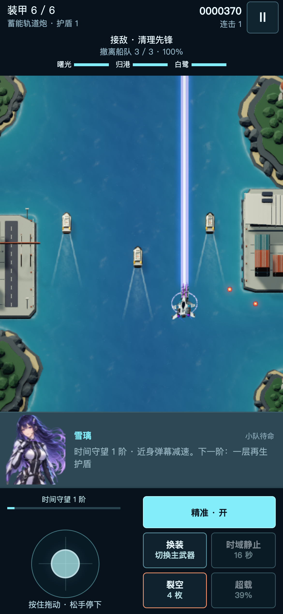
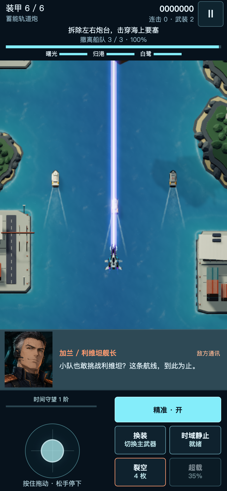
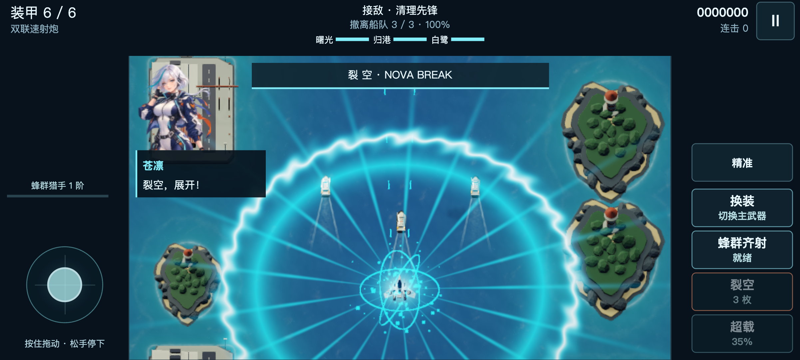

# 1.11 · 完整的移动驾驶舱

[在线试玩](https://geduolin1991.github.io/skybreak-last-flight/?v=1.11.0)。原来的分享链接仍然有效。本轮网页和 Mac 下载包统一为 1.11.0。

## 横竖屏

手机加载页、竖屏机库、任务简报和暂停页推荐横屏，但不会强制旋转，也不会阻止竖屏出击。转屏、切到其他应用或锁屏时会暂停并清空移动输入，点击“继续飞行”后在当前方向继续。

竖屏使用独立的战况栏、战场、人物通讯区和触控区。战场利用屏幕可用宽度，相机按真实区域重新计算投影，保留整个可飞行范围；绘制比例与显示比例一致。角色通讯出现和结束都不改变战场大小，避免字幕引起画面跳动。

## 人物与任务信息

- 三位驾驶员保留 Unity 原有的呼吸、眨眼和柔和随动，以清楚的半身立绘显示，不再被缩成窄小的横向面部裁切。
- 敌方指挥官仍使用各自的出场、紧张和临终表情，人物、姓名与当前台词一起切换。
- 竖屏通讯位于战场下方，长字幕正常换行；安静时显示当前驾驶员及专精说明。
- 救援船、电网或轨道接点的任务状态独立显示，不再被遭遇战标题替代。
- 显示再生护盾、真实技能名称、专精进度、升级与补给提示、僚机剩余时间。
- 暂停可查看当前任务、专精效果、下一阶能力、僚机姓名与最近 24 条实际通讯。

横屏控制区保持在两侧，矮屏也保留互不重叠的按钮。使用原有的中、英、日配音设置。

## 港口构图与性能

窄视野时，两侧海岸整体向航线靠近，宽视野时恢复原位。船队、飞机、碰撞与弹幕坐标不变。海岸几何只在视野变化时调整缓存顶点，不压缩模型、不重新构建关卡；码头车辆与岸线泡沫同步调整。

相同材质继续合批绘制，平时不更新这些顶点。保留三个画质档位、固定的绘制分辨率预算、抗锯齿、音效冷却与爆炸对象复用。

## 验证范围

网页版已通过 100 项布局及触控检查、WebKit 的 16 项检查、Android 的 8 项检查，以及电脑键盘、三名驾驶员、敌方通讯与 Boss 警报验证。

Mac 最终构建通过 278 项运行检查；三款飞机分别完成三章自然通关，未跳过关卡、修改血量或直接设置结局。以两倍模拟速度完成通关测试。原生人物动画捕获 384 帧，并检查三位驾驶员的机库与档案画面；网页半身立绘另行验证了实时动画。

发布前校验构建与源码对应关系、页面脚本完整性与内容安全策略，并扫描源码历史及解压后的网页构建资源，未发现密钥泄漏。

45 秒连续海岸战斗中，三个船体尾迹保持对齐，反复滚动与返回机库均正常；背景保持 118 个已合批渲染器。三个画质档位的绘制缓冲不反复变化，音乐连续。桌面 GPU 上的手机模拟平均约 60 帧，仅代表此测试环境。

手机验证使用桌面上的 iPhone、Android 和平板尺寸模拟，以及 Chromium / WebKit 浏览器；不等同于实体手机性能测试。Mac 包经过原生运行和通关检查，仍采用本地签名，不包含 Apple 公证。
