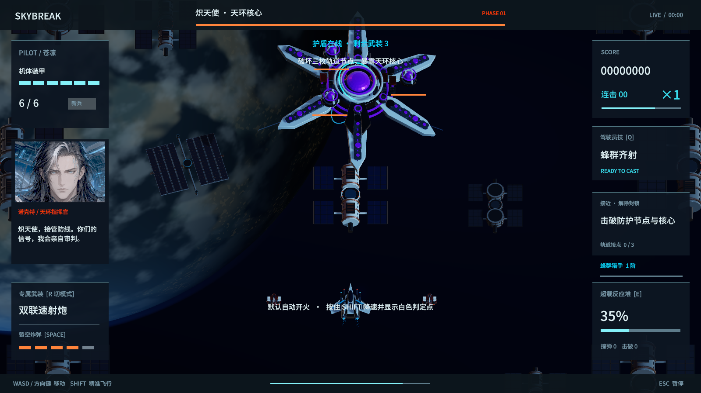
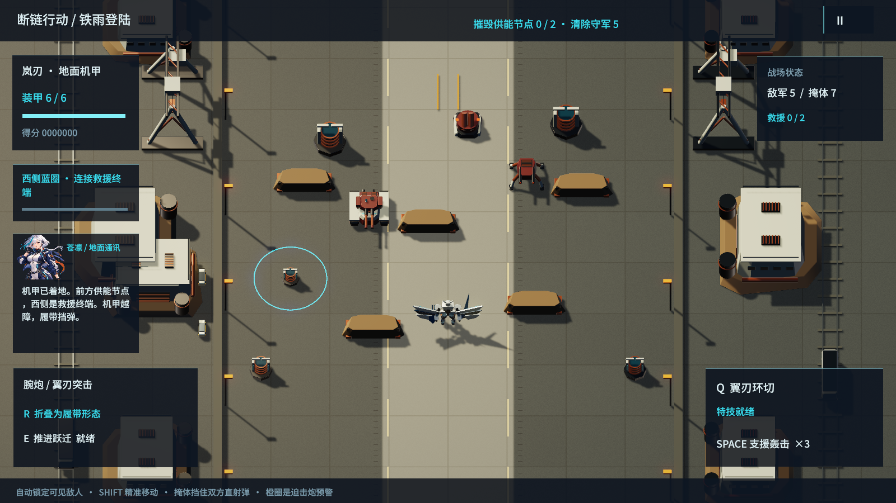
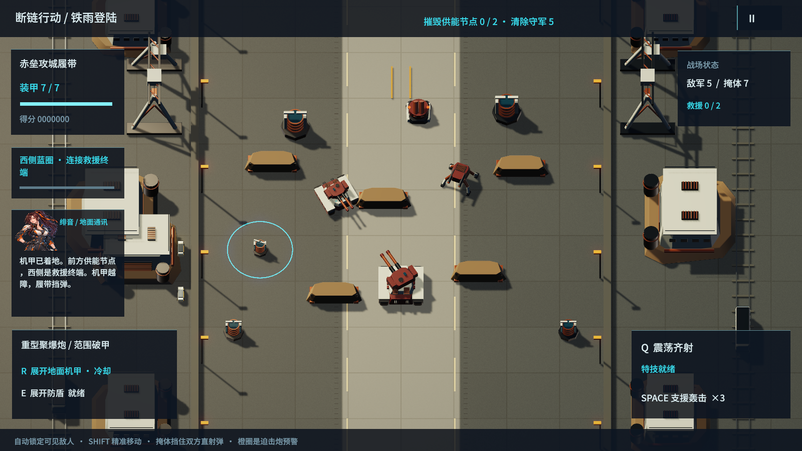

# 1.15 · 断链行动与轨道背景

从主菜单选择「地面战役 · 断链行动」。电脑版和触屏版都有独立入口；现有空战主线、章节解锁、专精和分享地址继续使用。

## 四个作战区域

两章地面剧情分别包含两个区域：

1. 铁雨登陆：降落货运港，破坏两座供能节点。第一次节点失守会触发有限增援；靠近西侧蓝色终端并保持连接 2.5 秒，可以救出港口工人。
2. 断桥守门人：清除外围护盾节点，攻击攻城首领。重炮有预瞄线，迫击炮有延时落点；首领开火后的散热窗口承受更多伤害。
3. 熔炉外围：沿维修设施突破守军，救出持有原始识别密钥的工程师。第二章开始前可选择火力、装甲或机动强化。
4. 最后一枚密钥：击破六足冥炉，切断伪造识别码的地面来源。救出零处、一处或两处避难所，会得到不同的收尾文本。

清除区域目标后，北侧绿色撤离区启用；停留 1.5 秒完成转移。救援是可选目标，离开区域前仍可完成。车辆在成功救援后驶离，地图上的敌军、掩体与炮击落点都参与实际规则。

## 地面操作

| 输入 | 机甲 | 履带 |
| --- | --- | --- |
| WASD / 方向键 / 摇杆 | 快速移动 | 有加减速的履带移动 |
| R / 变形按钮 | 折叠成对应履带底盘 | 展开对应地面机甲 |
| E / 功能按钮 | 短距推进跃迁，可越过低掩体并避开伤害，冷却 4.2 秒 | 3 秒防盾，可拦截来自前方的 6 次命中，冷却 8 秒 |
| Q / 特技按钮 | 三角色各自的翼刃环切、震荡齐射或棱镜贯穿 | 保留当前角色的地面特技 |
| Space / 支援轰击 | 消除敌弹，向敌方位置标记延时轰击；消耗有限弹药 | 同左 |
| Shift / 精准 | 降速微调 | 降速微调 |
| Esc / 暂停 | 暂停、重试断链行动或返回机库 | 同左 |

默认自动锁定可见目标，兼容 360 度地面交火；遮挡目标需要侧移、破坏掩体或使用范围技能。掩体能挡住双方直射弹，也可能被炮击摧毁。机甲与履带共用装甲、技能冷却和本次行动强化，变形不提供无限回血或无敌。

三种履带底盘分别强调双联速射、聚爆范围破甲、长距离贯穿。首领外围节点提供护盾；拆除后，正面装甲仍比侧后方坚固，散热期间受到 1.7 倍伤害。

## 画面、资产与声音

轨道星球缩小画面占比，云层减少细碎高对比纹理，使用柔和昼夜过渡与球面大气边缘。远处星点位于星球后方，居住舱、炼化设施和近处战斗使用不同的尺度、明暗与深度。旧的大型蓝色装饰圆环从背景构图中撤下。

15 件新增资产以 Blender 原生脚本制作，包含三种履带形态、地面敌军、两个不同外形的首领、掩体、能源节点、货运吊机、反应堆、工业建筑、轨道居住舱与炼化设施。源文件为 `Tools/GroundOrbit1.15.blend` 和 `Tools/GroundLandmarks1.15.blend`，FBX、Unity 预制体和生成脚本随源码包交付。未新增下载素材或外部账号依赖。

沿用现有配乐与音效素材，按普通交战、首领、结束状态切换音乐。新增地面剧情通过角色通讯字幕演绎；现有空战的 148 个三语配音事件、444 段录音继续保留，未把新增地面字幕冒充已录制的新配音。

## 平台和进度

网页支持桌面键盘、手机横屏和竖屏；推荐横屏。新增地面入口、变形、功能技能、冷却、救援和任务状态通过原有安全的触屏消息接口传递。地面战役的完成情况、最佳分数和最佳救援记录单独保存在本机浏览器或 Mac 玩家偏好中，不改变空战章节解锁。

浏览器仅访问同一站点的静态文件；没有账号、联网对战或服务器写入。继续保留 CSP、入口脚本完整性检查和无第三方运行依赖的发布方式。

运行验证和实际平台边界见本轮验证记录，不能把桌面模拟手机等同于实体手机测量。

## 当前版本实机画面

