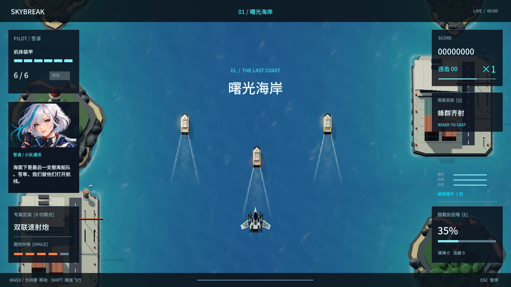
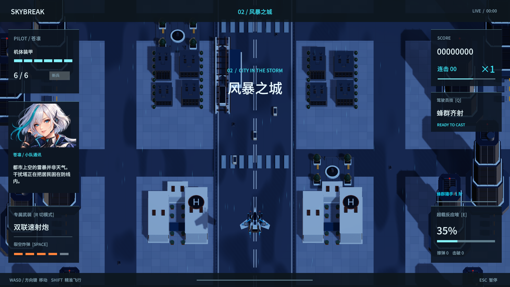
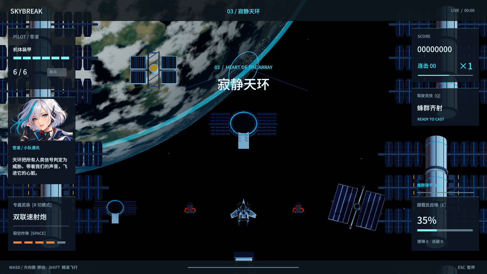

# 1.12.1 场景漂移修复

玩家截图中的两座航标曾直接挂在环境根节点，岸线分区却独立向后滚动，导致航标脱离码头、保持在水面固定位置。现在航标固定在空闲码头角落，其基础坐落于码头表面，楼梯朝内。塔身参加岸线合批，灯头保留旋转；横竖屏取景时两者使用相同岸线偏移。

同类检查覆盖海岸、城市和轨道三张地图：

- 轨道观测站与太阳翼改为所属场景分区的子物体，随周围设施一起经过镜头；机械转动部件排除静态合批。
- 港口车辆、城市车辆和列车抵达各自路径终点后停下，不再在可见区域跳回起点。只在整块地图离开镜头、循环回收时重置。
- 城市撤离巴士移除船只的侧摆、起伏和倾斜。
- 城市道路横向路口与真实斑马线对齐；供电分区与十块场景共用 140 米循环，避免重复经过后路面亮灯与建筑错位。
- 护送船队、接驳船与任务目标保留各自任务运动，不作为背景物件循环。

## 验证

- 原生运行共 396 项检查通过，其中新增场景专项 49 项。三张地图分别在竖屏、电脑与手机横屏相机比例下推进 60 秒，总计每张地图 180 秒模拟循环；确认固定设施相对所属场景不漂移，回收发生在镜头外。
- 浏览器专项在每关实际运行约 21 秒，核对模型与分区坐标。城市测试主动恢复三处供电，记录到列车连续行驶与到站停留；未出现路径端点瞬移。此项使用受控章节跳转，不能视为自然通关。
- 三架飞机另行通过新兵难度、无研究加成的三章自然通关；没有修改 Boss 生命、跳过战斗计时或给予无限生命，使用两倍模拟速度。
- 海岸连续战斗 40 秒检查通过，船尾航迹与三艘护送船对齐，背景回收和回机库无重复物件。
- 横竖屏界面与输入检查 100 项、剧情检查 49 项、WebKit 检查 16 项、Android 检查 8 项通过；电脑键盘、音乐和暂停回归通过。
- 浏览器三档画质各连续战斗 12 秒，约 61 FPS；音乐持续播放、绘制尺寸稳定、击破处理峰值约 0.2 ms。
- 原生 180 次连续击破：平均帧时间 17.592 ms、95% 分位 17.581 ms、99% 分位 49.343 ms；击破处理峰值 0.115 ms，没有增加冲击波对象。极端压力测试仍存在少量帧时间尖峰。

性能与移动端结果来自这台 Mac 及浏览器设备模拟，未进行实体手机实测。音乐和配音文件沿用已核验的 1.12.0 资源，本轮运行再次检查实际播放。

