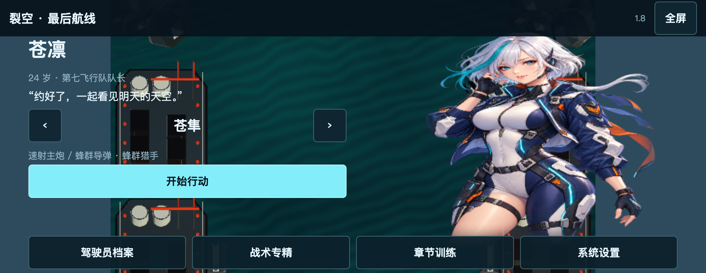
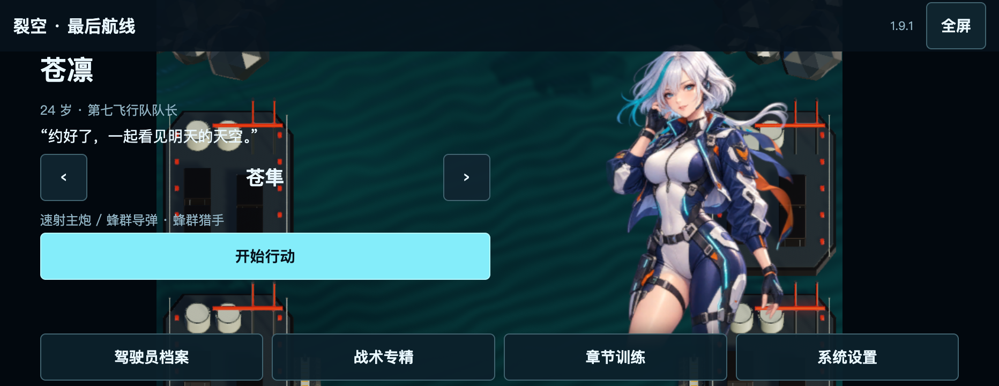

# 1.9.1 · 手机横屏显示修复

这是网页版补丁。Mac 下载版继续保留已验证的 1.9.0，关卡、战斗数值、配音资源与存档格式没有变化。

[打开修复版](https://geduolin1991.github.io/skybreak-last-flight/?v=1.9.1)。设置 → 画面清晰度可选择「均衡」「清晰」「流畅」。已有进度继续保留，不需要清除网站数据。

## 修复内容

- 角色按原始 2:3 比例显示，不随手机宽高拉伸；通讯头像也保持裁切后的原比例。复现时，旧版在 844 × 390 下横向拉伸了 46%，932 × 360 下拉伸了 75%。
- 显示画布、内部渲染和摄像机统一为 16:9。屏幕较宽时，两侧留给触控界面，不再对画面做非等比缩放。
- 使用稳定视口高度；转屏或全屏变化待布局稳定后更新尺寸。只在尺寸确实变化时调整绘图缓冲，不根据短期帧率来回切分辨率。
- 原手机版固定低 DPI。现在默认「均衡」提高分辨率，另有更清楚和更省电的档位，均受像素预算限制。844 × 390 屏幕实测渲染尺寸分别为：均衡 1040 × 585、清晰 1376 × 774、流畅 688 × 387。
- 六张驾驶员图片与闭眼图片在网页构建中使用 mipmap 和三线性过滤，减少缩小后头发、服装细线在动态中的闪烁。
- 手机后期增加方向性边缘平滑、辉光降采样过滤，明确设置临时纹理过滤和边界模式；保持原有后期通道数量。没有跨帧历史图像，不引入拖影。
- 将手机阴影距离从 35 调整为 65，使距摄像机约 48 的海面和城市地面能接收阴影。
- 修正手机 60 帧目标被刷新率同步覆盖的问题；高刷屏不再默认多渲染一倍画面。离开手机模式时恢复原设置。

尺寸处理依据 [Unity 画布说明](https://docs.unity3d.com/6000.0/Documentation/Manual/webgl-canvas-size.html)：显示尺寸与内部渲染尺寸不同会缩放输出，固定 `devicePixelRatio=1` 会使用低 DPI。手机渲染预算是本项目的取舍，不代表所有设备的最大能力。

## 本轮验证

同为 932 × 360 可视区域，两个截图的动画时刻不同。旧版的立绘框横向拉伸，修复版保留源图比例：

Web 构建成功，0 错误、0 警告。29 项显示检查通过，覆盖 844 × 390、932 × 360、667 × 320、1024 × 768，分别从竖屏转回横屏，检查比例、角色边界、清晰度、溢出、稳定后的缓冲尺寸以及三档画质。

三档画质各连续战斗 12 秒，共采集 180 次状态。最终游戏帧率均值分别为 60.27、60.30、60.30，单次击破 CPU 采样最高 0.60 毫秒；没有持续调整绘图缓冲，音乐保持播放。修复帧率限制前，同环境约为 121 帧。这些数据来自桌面 GPU 的手机模拟，不能声称实体手机均可保持 60 帧。

三位角色的实际修复后截图已查看，低分辨率拉伸与多余的灰色渲染边栏已消除。设备模拟和桌面 WebKit 能检查对应浏览器行为，但不能替代用户那台实体手机的 GPU、系统版本和实际浏览器工具栏环境。

15 项 Chromium 手机操作回归通过，包括双指边移动边放炸弹、英日语实际播放、转屏暂停、恢复和设置保存。另完成 WebKit 26.5 的 11 项检查：以 iPhone 15 配置启动、反复旋转、清晰画质、英文试听、真实触摸出击与炸弹、暂停和恢复，没有页面或渲染错误。

GPU 调用记录确认六张角色图片均有 12 个纹理层级并使用三线性过滤。连续 12 张机库截图的采样区域平均亮度为 67.58–70.31，没有黑帧或全局亮度突跳；期间绘图缓冲尺寸变化 0 次。这一短样本不代表所有设备、所有场景都不会闪动。
