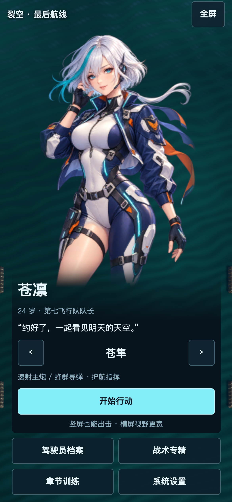
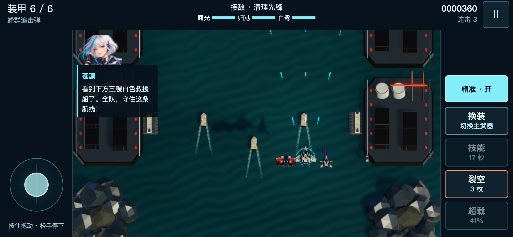
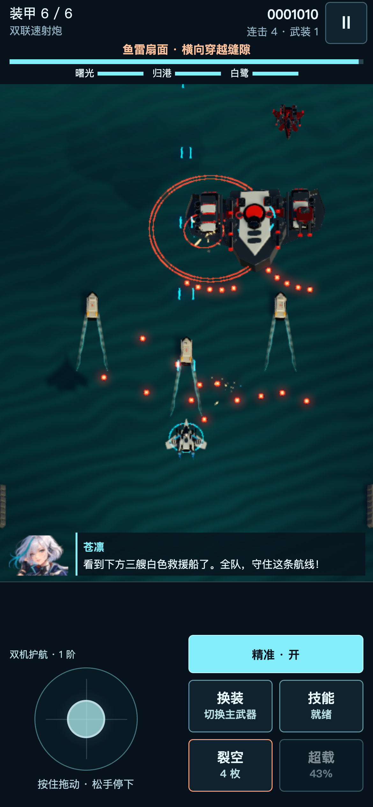

# 1.9.2 · 横竖屏都能继续飞行

[打开网页版](https://geduolin1991.github.io/skybreak-last-flight/?v=1.9.2)。手机与电脑继续使用原来的网址；Mac 下载版保持 1.9.0。已有存档和声音设置继续保留。

## 战场不再被顶部状态栏覆盖

原手机版把带深色背景的状态栏叠在画布上。现在横屏预留 50 像素、竖屏预留 88 像素的独立信息区，游戏实际渲染在其下方。装甲、首领血条和护送船状态都放在这个区域。

横屏技能键放在右侧，摇杆放在左侧。手机震动幅度降低，保留命中和爆炸反馈。Boss 战增加当前攻击预告、危险提示色和剩余武装数量；支援期间显示另外两架僚机的剩余时间。

## 竖屏可以直接玩

- 取消强制旋转遮罩。机库只显示「竖屏也能出击，横屏视野更宽」的建议。
- 选机、简报、驾驶员档案改为纵向布局，专精、研发和设置支持单列滚动。
- 战斗采用 3:4 窗口，竖屏镜头保留完整的左右移动范围。人物保持原始比例。
- 摇杆与技能键位于战场下方，缩短手指遮挡弹幕的时间。
- 正在战斗时旋转手机会暂停并释放输入；在当前方向点击「继续飞行」即可。普通浏览器高度变化不会反复触发旋转暂停。
- 暂停界面可以直接切换「均衡 / 清晰 / 流畅」，无需退出本局。

镜头取舍基于 [Unity 的正交镜头尺寸定义](https://docs.unity3d.com/6000.0/Documentation/ScriptReference/Camera-orthographicSize.html)。竖屏增加纵向可见范围，并确保横向走廊可见；横屏保留更宽的环境视野。两个方向均使用相同的敌人、弹幕和伤害规则。

## 验证范围

Unity 网页构建成功，0 错误、0 警告。68 项手机检查通过：覆盖 390×844、360×640、430×932、768×1024、844×390、667×320，保留真实 3 倍设备像素密度，检查横竖屏菜单、人物比例、镜头边界、触控区边界、双指移动与技能、转屏暂停与继续以及画质稳定性。

WebKit iPhone 配置的 16 项检查通过，包括竖屏直接开局、英语实际播放、炸弹、双向转屏与暂停画质设置。电脑端选机、音乐连续播放、方向键、炸弹和暂停均通过。

在本机提前生成真实首领进行显示检查，连续采样 80 次：首领提示、血条与护送目标的最低边缘为 83.5 像素，游戏画面从 88 像素开始，没有覆盖。实际攻击预告及危险提示色随首领攻击变化；这项检查不等于重新完成三章流程。

三档画质分别连续战斗 12 秒，共采样 177 次。均衡、清晰、流畅的平均游戏帧率为 60.22、60.56、60.20；单次击破 CPU 采样最高 0.60 毫秒，音乐保持播放，每个档位内绘图缓冲尺寸没有持续变化。该结果来自桌面 GPU 的手机模拟，并非实体手机性能保证。

实体手机尚未连接测试，桌面设备模拟不能替代用户手机的 GPU、系统工具栏与散热表现。
