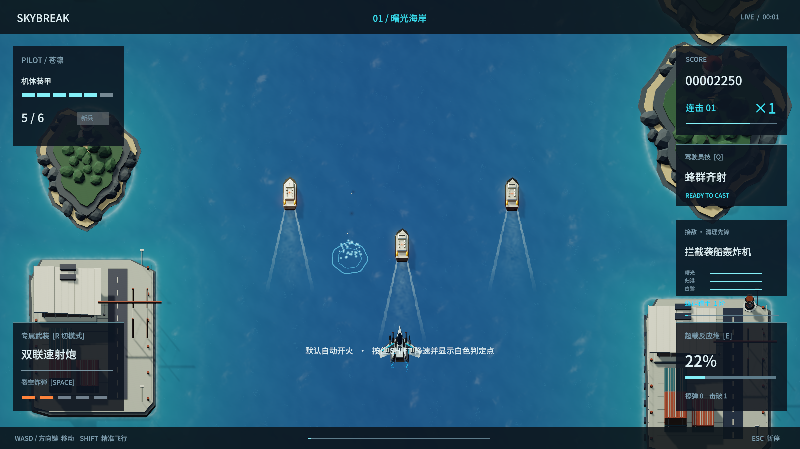
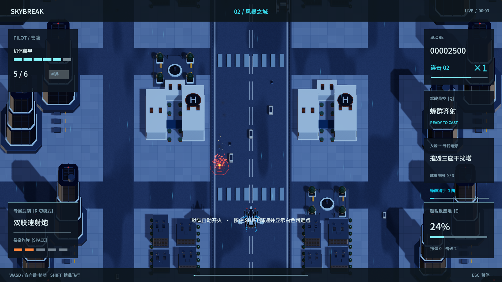
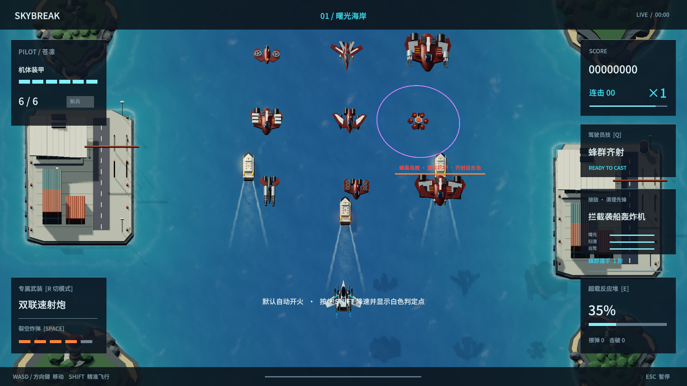
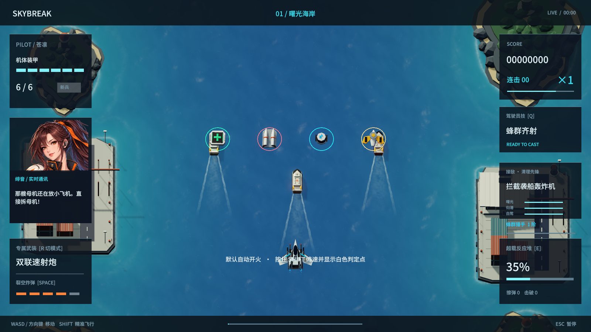
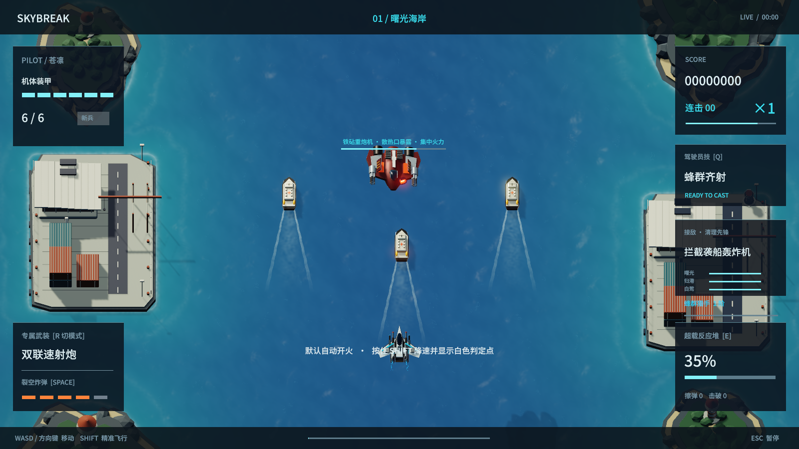

# 1.14 · 敌机与坠落反馈

同一试玩链接更新网页与 Mac 下载版。原有三台独立机甲、三章战役与结局、中英日配音、横竖屏操作继续保留。

## 击落后会发生什么

- 部分轻型无人机在空中直接解体；裂空炸弹范围内的普通敌机也可直接爆散。
- 其他空中敌机拖出烟火、翻滚并向背景下降。海面产生向上喷出的水花和扩散涟漪；地面产生爆燃、碎屑与短暂焦痕。
- 轨道章节使用真空中的残骸消散。不会凭空出现海面水花。
- 分数在击落瞬间结算，残骸立即退出碰撞和战斗判定。后续撞击不重复加分，也不伤害护送船。
- 水花与焦痕跟随背景滚动，暂停时一起冻结，换关和返回机库时清理。

这里使用与海岸渲染一致的地表轮廓判断撞击介质，不包含建筑逐栋破坏或刚体残骸碰撞。

以上截图使用受控的单机击落来检查撞击高度与粒子效果。

## 九种敌机与四件补给

重建巡逻无人机、截击机、铁砧重炮机、运输机、俯冲轰炸机、护盾无人机、轨道狙击机、布雷机、蜂巢母舰。轮廓和装备按照作战职责区分，加入座舱、发动机、翼面、武器、散热结构；保留各自原有攻击方式。

上图是受控的模型检查场景，九种机体同时排布用于对照，不代表关卡按此队形出场。

| 补给 | 外观 | 效果 |
|---|---|---|
| 装甲修复舱 | 绿色十字、装甲外壳与提手 | 装甲 +1 |
| 裂空弹药架 | 橙色双弹体与固定架 | 裂空炸弹 +1 |
| 反应堆电池 | 青色线圈、电池笼与闪电标识 | 能量 +25 |
| 双机支援信标 | 金色通信核心与展开翼阵 | 召来未选中驾驶员的两架限时僚机 |

补给以小幅浮动和缓慢摆动提示可拾取，保留原有吸附与拾取距离。以上数值仍受各自上限约束。

## 重甲敌人的反击时机

铁砧重炮机基础生命为 170，蜂巢母舰为 360，再叠加既有关卡与模式系数。装甲完整时承受 70% 伤害；重炮以 3.2 秒间隔齐射，每次打开散热舱 1.65 秒，母舰放出两架无人机后打开 2.2 秒，此时承受 170% 伤害。生命降至 35% 以下后永久破甲，承受 112% 伤害。

玩家可以在敌人攻击后集中火力，也可以先清理护盾机。手机在上方既有状态区显示最近的重甲威胁；电脑只显示一个重甲提示，Boss 血条优先。

## 验证范围

最终本机运行回归通过 484 项检查。连续击破采样包含 180 次击破和 360 帧：平均帧耗时 17.50 ms，P95 为 17.58 ms，P99 为 49.18 ms；单次击破逻辑的最高 CPU 耗时为 0.166 ms。该采样仍有偶发长帧，不能据此声称所有设备都恒定 60 帧。三架飞机均在正常关卡出场节奏下自动到达 Victory；首领实际出场约为 75、95、110 秒。当前网页通过 100 项横竖屏与触控检查、三张地图的背景回收检查、Boss 状态栏检查，以及 74 秒实际输入驱动的连续击落测试。三档画质在 Mac 的手机模拟环境下平均约 60 帧，采样期间音乐连续播放。模型与表面效果已用实际 Unity 游戏画面检查；网页测试使用 Mac 上的浏览器和设备模拟，不等于实体手机测试。自动战役也不等于所有难度的长期真人平衡评估。

导入后的敌机为每架 2,780–12,972 个三角形、5–11 个渲染组件；补给为 940–2,188 个三角形、每件 4 个渲染组件。普通击落复用既有敌机模型，桌面最多保留 9 架下坠残骸、触屏模式最多 5 架；海陆表面效果复用 10 个实例。

本轮修复了复查中发现的散热舱左右方向、齐射间隔覆盖散热窗口，以及水面涟漪材质不响应淡出的问题。自动验证对动画与坠落等待实际状态完成，并保留超时，不再只依赖固定等待时间。

网页连续击落的这次采样中，观察到 28 次坠海与 10 次空中解体，峰值同时存在 3 架下坠残骸和 3 组表面效果；数据来自正常战斗输入，未直接修改敌人生命或关卡时间。Chrome、WebKit 的 iPhone 模拟、Android 的 Pixel 模拟和桌面键盘操作检查全部通过。详细本地记录见 [1.14 验证数据](敌机与坠落验证1.14.json)；公网资源与发行校验结果另保存在发布记录中。

原始模型场景：`Tools/EnemyFoundry1.14.blend`。声音为三段原创程序合成效果，既有配乐和 444 段三语角色配音未改动。
