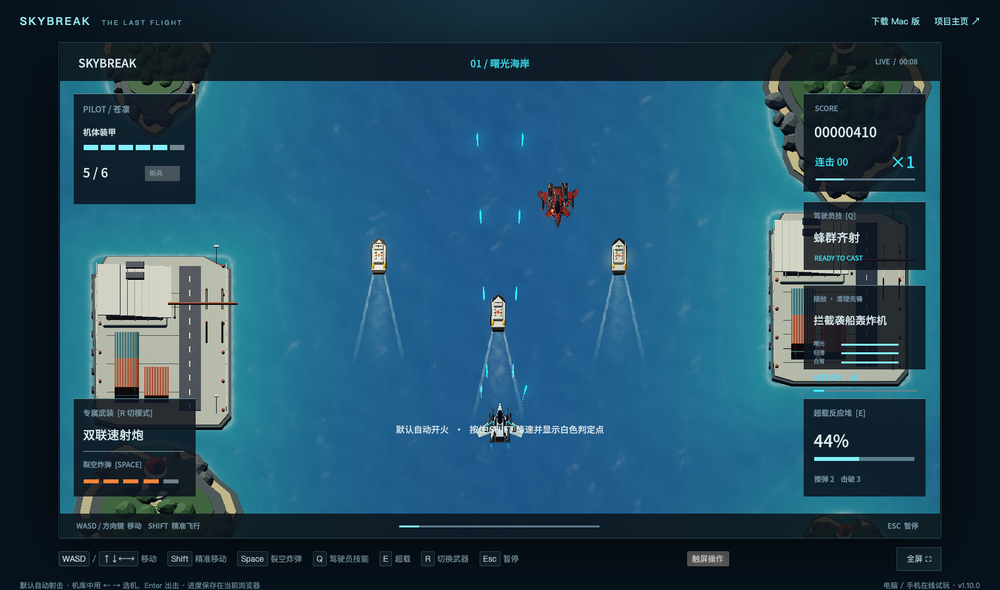
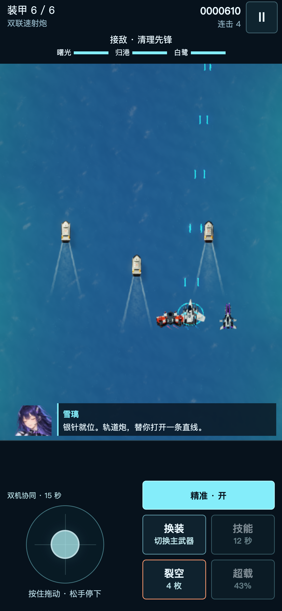

# 1.10 · 曙光海湾

[打开最新版网页](https://geduolin1991.github.io/skybreak-last-flight/?v=1.10.0)。原有分享链接继续有效。网页版更新至 1.10.0，Mac 下载包保持 1.9.0。

## 海面与晨光

海水改为中央蓝色航道、近岸青蓝浅水的配色。多方向、不同尺度的细浪打破旧版规则斜纹；细碎波峰、柔和反光和缓慢变化的水色共同形成层次。正交镜头使用一致的观察方向计算反光，晨光方向也随之调整，保留船体和建筑的明暗关系。

岸边白浪根据码头和礁岸的位置移动，不会在背景循环时留在旧位置。三艘护送船分别有船艏水花、展开的航迹和螺旋桨扰流；船撤离后尾浪延长，沉没后不再持续产生航迹。替换原来使用发光线条绘制的尾浪。

## 原创海岸模型

使用 Blender 新建港口与灯塔礁岸：浅色码头、道路标线、护栏、系缆柱、防撞设施、带屋顶筋条的货柜、玻璃候船厅、折面雨棚、吊机桁架、层叠岩岸、沙色岩台与植被。两岸的港口和岛礁错开分布，尺寸有所变化。码头救援车辆沿道路移动，并在码头范围内循环。

## 手机与渲染开销

- 延续 1.9.2 的横竖屏镜头、独立信息区、双指操作与暂停画质选项。
- 海浪使用一张 512×512 的周期频谱纹理，启用多级纹理和三线性过滤。
- 岸边白浪与船尾浪在水面同一绘制步骤中完成；静态港口、礁岸继续按材质合批。
- 每帧使用固定数组，只向海面传入最近八处岸线，没有增加反射相机和全屏渲染步骤。

## 构建与复现

原始 Blender 工程为 `Tools/Coast1.10.blend`，生成器为 `Tools/build_coast_110.py`。在 Blender 生成资产后执行 Unity 的 `SkyCoastBuild.Prepare`，再运行 `Tools/build_web.py`。Web 构建在独立目录中完成，源码、资源和原生下载包分别记录版本。

## 本轮验证

Unity WebGL 构建成功。网页构建中的 830 份游戏脚本、着色器、模型、材质及相关导入文件与当前源码逐一匹配，构建指纹一致。

手机模拟通过 68 项横竖屏检查，覆盖六种屏幕尺寸；WebKit iPhone 环境通过 16 项开局、声音、炸弹、转屏和暂停检查。电脑端选机、音乐连续播放、方向键、炸弹和暂停正常。

45 秒连续海湾战斗采样 192 次，海岸经过多次循环后仍保留 20 处正确的场景轮廓；三艘船的航迹位置、音乐播放及返回机库后的清理正常。平均游戏帧率 60.07，击破 CPU 采样峰值 0.60 毫秒。

均衡、清晰、流畅三档各连续战斗 12 秒，共采样 180 次，平均游戏帧率分别为 60.09、60.09、60.06，各档绘图缓冲尺寸稳定。该数据来自桌面 GPU 的手机模拟，不代表实体手机的帧率。

首领显示检查提前调用真实首领，采样 80 次；攻击提示和血条最低边缘为 83.5 像素，战场从 88 像素开始，未覆盖战场。这项检查不等于重新完成全部三章。

网页 CSP、入口脚本和样式完整性、篡改拒绝及路径边界检查通过。固定版本的敏感信息扫描器校验后检查了网页文件，以及压缩数据包、JavaScript 和 WebAssembly 中提取的可打印文本，未发现密钥匹配。扫描不能证明不存在其他漏洞。

