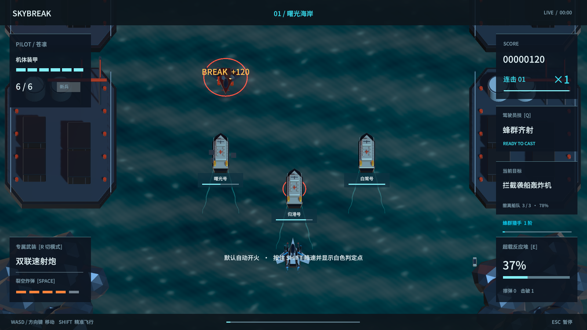
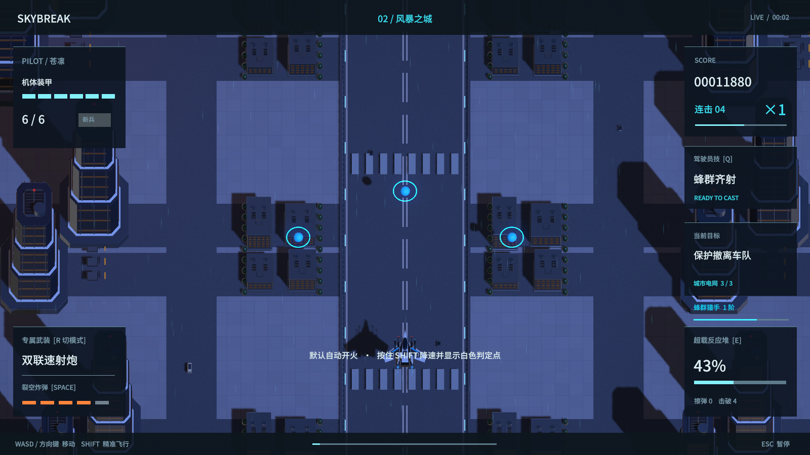
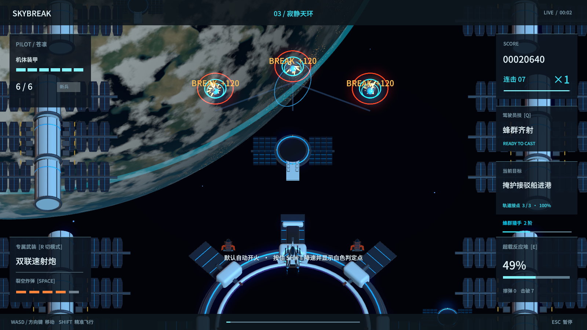
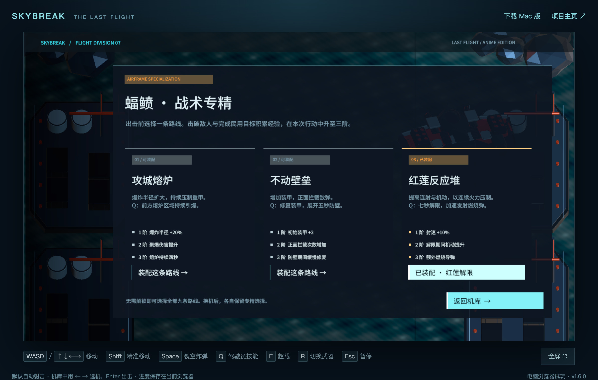

# 裂空 1.6 验证记录

## 构建与实机

Unity 6000.6.0f1 的 macOS 候选成品与 WebGL 成品均构建成功。原生运行完成 **166 项机制检查**，无失败；覆盖既有武器、音乐、炸弹、机械首领、角色技能，以及本轮的民用行动、僚机、敌机、专精和对白失效处理。

新增检查包含：救援船各自受损与冒烟、炸弹被拦截时不伤船、存活船队驶离、地面目标的画面与碰撞对齐、逐座干扰塔供电、轨道八秒上传、两位未选驾驶员入队、实际队友攻击、暂停冻结、补给延时、离场清理、护盾发生器保护邻机、锁定轨道炮、独立布雷与无人机母机、九条专精的三阶成长和主动技能、盾量耗尽后的受击，以及新敌机接触伤害。

三架飞机分别以新兵难度、零研发与新驾驶员状态完成三章并达到 Victory，三个民用目标全部完成。自动控制器没有直接修改生命、无敌时间或关卡时间来跳过战斗；模拟以二倍时间运行。它会优先拦截袭船目标和干扰塔，因此这些结果不代表普通玩家一定能一次完成全部目标。

原生检查的末帧观测值约 59 FPS；这是当前机器上的检查记录，不是跨设备性能承诺。三人机库、档案和 384 帧动态立绘另外用同一原生成品重新捕获；没有修改既有角色随动算法。

## 浏览器与配音

最终网页实战确认：3.19 秒时船队通讯对应三艘在场救援船；约 20 秒实际拾取信标后，支援名单为未选的绯音与雪璃；暂停后支援时间保持不变。技能语音在实际按键触发后播放，并请求到了版本化资源。

实际浏览器点击验证九条专精均可选择，换机保持音乐连续，刷新后保存机体与路线选择。三位驾驶员档案分别播放对应角色的配音，字幕归属正确；配音结束后音乐恢复。声音设置检查了音量、静音、刷新保存与恢复。

在关闭音乐的情况下，浏览器音频输出中检测到独立人声波形；本次采样最高 RMS 约 0.160。不能用这一信号检查代替真人对语气、音色和自然程度的判断。

98 条配音均由独立语音识别和波形检查复核，所有片段在既定的音节差异复核阈值内，没有整段静音或数字削波。疑似错读的片段进行了重录。逐条文本、识别结果与最终音频校验值见 [配音核验数据](配音核验1.6.json)。此流程允许中文同音字等识别差异，不代表每一字都经过真人听审。

紧急警告会抢占低优先级行动短句。首次网页测试曾无条件等待一次技能短句，因当时已有更高优先级警告而超时；后续验证在通讯空隙触发技能，并把优先级抢占与实际播放失败区分开来。

网页资源使用 `Build/v1.6.0/` 独立路径，避免浏览器混用 1.5 缓存。部署后再使用新的浏览器会话检查公开站点。

## 版本对应

- 原生成品标识：`2c419c89dcc3ca434a973c915a56e68e70135d9e83b0240fd827376e6f457bd6`
- WebGL 构建标识：`4dbadc36dfbd72caa8e044d76d08694bd710769895c684fab0209faa570066bb`
- 公开仓库独立保留源码；网页分支只放编译产物，旧发行版保留。

## 本轮实机画面

以下为原生机制检查场景；部分场景由检查程序布置，以确认特定状态。

