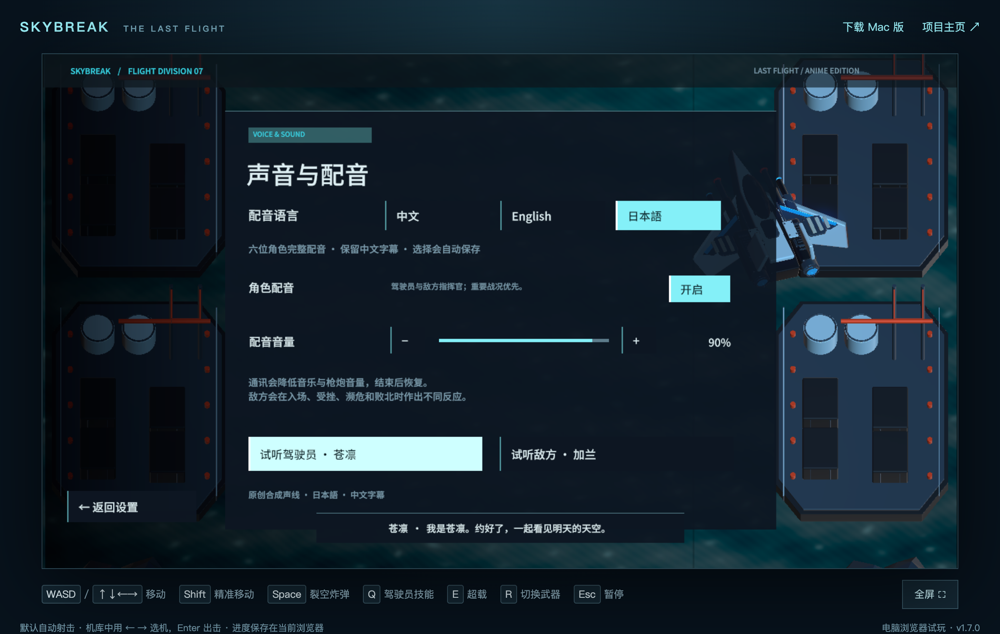
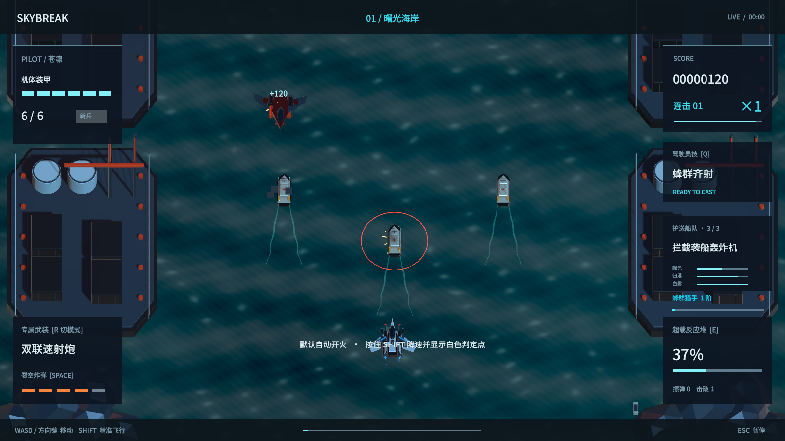
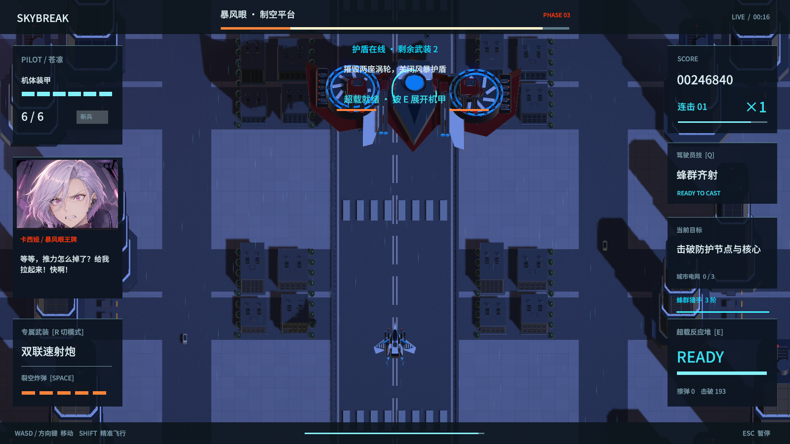

# 1.7.0 验证记录

验证日期：2026-09-07（America/Los_Angeles）。本轮围绕击破卡顿、护送目标深度与遮挡、三语配音和敌方指挥官的战况反应。

## 构建与完整航线

- Unity 6000.6.0f1；macOS 与 WebGL 构建成功，构建报告均为 0 错误、0 警告。
- 原生构建指纹：`4c74b40cbb429a3354dbb10282a1aacdf1d1772f42d676fca826e94c2acbabe5`。
- 网页构建指纹：`8a7694218a1ef193b5dc803e97323506f8bbd97aa6793718c63cfa2a0e329ab4`。
- 同一最终原生构建完成 224 项运行检查，无失败，包括全部 12 类敌人的回收、击破停顿、船队投影、三种配音语言、Boss 情绪阶段和队列清理。
- 三架飞机均从新驾驶员档案自动操纵通关；无无敌、无跳关、无修改 Boss 生命值，以两倍模拟速度跑完整航线。三章任务结果均成功，专精到达 3 阶。

| 飞机 | 航线模拟用时 | 击破 | 受击 | 结果 |
|---|---:|---:|---:|---|
| 苍隼 | 399.5 秒 | 283 | 0 | Victory |
| 蝠鲼 | 426.6 秒 | 285 | 2 | Victory |
| 银针 | 394.7 秒 | 279 | 1 | Victory |

这些检查验证流程与机制，不代表真人难度平衡或所有设备的长期验收。

## 流畅度

原生压力场景在 360 帧内击毁 180 架敌机：平均帧耗时 18.427 毫秒，P95 为 17.023 毫秒，P99 为 83.039 毫秒；单次击破逻辑最高耗时 1.511 毫秒。火花峰值 795，低于 1000 预算；预热之后新增冲击环对象为 0。仍存在偶发尖峰，没有达到所有帧都稳定的程度。

同一台电脑、同一浏览器尺寸、同一苍隼左右移动流程，对照旧线上 1.6 与本机最终 1.7，各运行约 32.6 秒。期间没有构建或语音生成任务。记录的是浏览器 requestAnimationFrame 间隔，并非 Unity GPU 每帧耗时；不同战局、随机数和系统调度会影响结果。

| 指标 | 1.6 | 1.7 |
|---|---:|---:|
| 有效浏览器帧数 | 3716 | 3713 |
| 平均间隔 | 8.763 毫秒 | 8.799 毫秒 |
| P95 | 9.2 毫秒 | 10.0 毫秒 |
| P99 | 32.4 毫秒 | 16.7 毫秒 |
| 超过 33.4 毫秒 | 28 次 | 30 次 |
| 超过 50 毫秒 | 11 次 | 10 次 |
| 击破数 | 20 | 26 |
| 画布像素 | 2071 × 1163 | 1725 × 969 |

1.7 实战中的击破逻辑峰值为 0.8 毫秒。P99 改善，但平均值与长尖峰数量相近，不能据此宣称彻底消除卡顿。降低像素倍率也参与了这次整体结果，不能将收益全部归于对象池。旧版每次击破新敌种时施加全局慢动作的问题已由代码修复及运行检查覆盖。

## 配音与敌方角色

110 个事件 × 中文、英文、日文，总计 330 段音频。资源检查确认全部存在且为有效单声道音频。新增 232 段通过波形、时长与自动语音识别检查；日语 110 段额外使用独立识别器交叉复核。识别中发现的数量词、动词及短句错读经过重录；日语实际输入读音保存在 `Tools/japanese-readings-17.json`。

完整文本、识别输出与最终文件哈希见 [配音核验1.7.json](配音核验1.7.json)。识别仍有同音字、复合词拆写、非语言呼喊遗漏；该报告是模型辅助校对，不是母语真人听审认证。

本机浏览器实际点击三种语言、驾驶员试听与敌方试听，每种语言均预载 110 段，实际播放状态和增益正常。静音停止播放；刷新后保持日语设置，再切回中文成功。流程无 JavaScript 或控制台错误。Unity 异步音频加载期间仍有“音频元数据尚未载入”的信息日志，播放检查正常。

三个 Boss 的入场、受挫、濒危与败北事件均在原生运行中验证。捕获入场、濒危和败北截图共九张，并抽查加兰入场、卡西娅濒危、诺克特败北三张；表情帧与当前指挥官一致。加兰强撑与不服，卡西娅从嘲笑到惊慌，诺克特从严肃到低声告别。直接击毁、返回机库、章节切换均清除过时台词，避免补播不存在的战况。

## 画面检查

最终原生构建捕获三份机库、三份驾驶员档案和 384 帧动作画面。检查第 96 帧三位驾驶员的轮廓与界面，版本标记为 1.7.0；此次没有改动既有身体随动。动作预览由本次捕获重新编码。

检查海岸护送画面：三艘船更小，位于飞机下方的海面层，独立尾流可见；船队血条位于任务侧栏，不覆盖飞机。海岸投弹与地面敌机的屏幕投影对齐检查通过。

立绘资源来源和最终提示词见 [BossArt-1.7.md](BossArt-1.7.md)。
