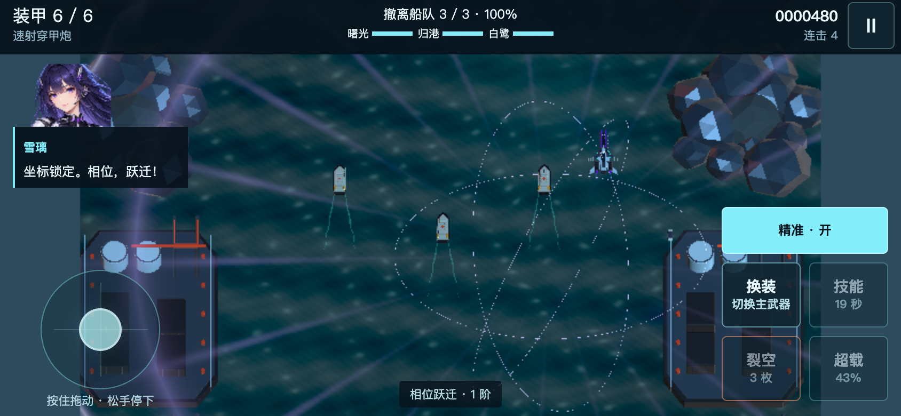
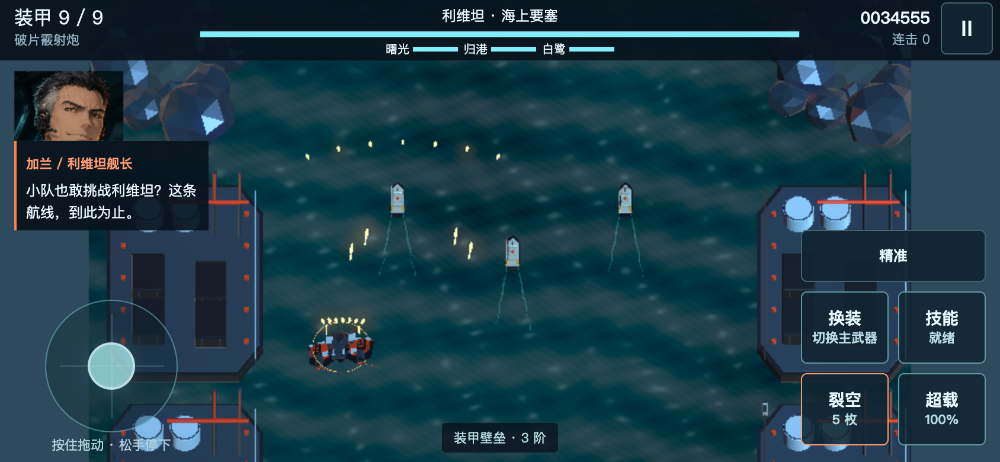
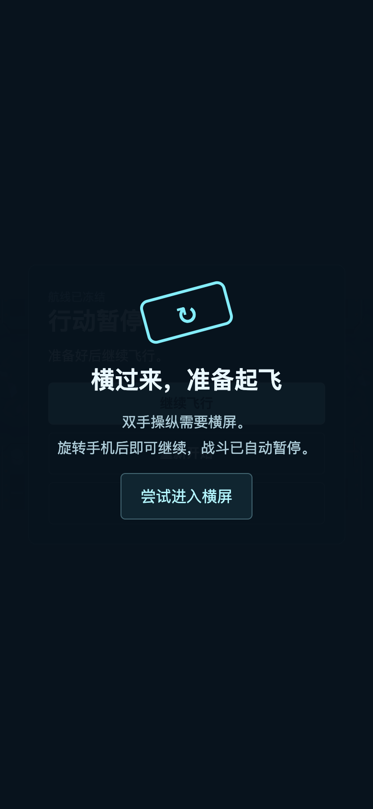

# 1.8 手机版验证记录

本轮在 Unity 6000.6.0f1 构建完整 macOS 与 Web 游戏。验证内容为手机自动识别、完整触屏流程、多点输入、暂停恢复及电脑版回归。浏览器证据使用 Chromium 设备模拟；没有使用实体 iPhone、实体 Android 或原生 Safari 验收，也没有测量手机的温度、长期帧率和内存峰值。

## 构建与原生规则

- macOS 和 Web 均构建成功，错误 0，警告 0。
- 原生规则检查：245 项通过，0 项失败。其中新增 21 项触屏状态、输入和质量切换检查。
- macOS 构建与运行检查、三架飞机通关、384 帧驾驶员动画捕获均使用同一个输入指纹：`5e454e1dcdd32ff84e704dad22824b911dc633b2dab56f95039adec377dc7d1f`。
- Web 独立构建指纹：`2d6c536e503894bb1ed228cf63e811bf518b9f80f9b72c4ddad9e5ebd6a380dd`。Web 与 macOS 使用各自的平台构建设置，因此指纹不同。
- 打包程序要求构建输入、所有原生检查和动画捕获的指纹一致，且规则检查至少 245 项通过。

旧的最终 Boss 检查只等待固定 4.6 秒。在并行构建争用资源时，游戏模拟的帧间隔限制会使它过早读取状态。本轮改为等待实际关卡状态变化，最多 10 秒；没有改变 Boss 生命、伤害或游戏时钟。

## 三机完整主线

自动驾驶从新存档开始，不加研发、不覆盖无敌、不跳时间和生命，采用两倍模拟速度。三架飞机均完成三章、三项民用目标及最终结局；这属于逻辑与流程验证，不代表真人难度平衡验收。

| 战机 | 游戏时钟 | 击破 | 受击次数 | 通关装甲 | 结果 |
|---|---:|---:|---:|---:|---|
| 苍隼 | 402.4 秒 | 281 | 0 | 6 / 6 | Victory |
| 蝠鲼 | 431.8 秒 | 290 | 2 | 7 / 7 | Victory |
| 银针 | 394.9 秒 | 270 | 1 | 6 / 6 | Victory |

## 浏览器触屏与键盘

844 × 390 横屏、390 × 844 竖屏，模拟 iPhone 的触屏特征并通过 Chrome DevTools 协议发出多触点事件。最终 Web 构建的 15 项流程检查全部通过：

- 点按切换三位驾驶员、装备专精；英语和日语试听实际进入对应录音播放状态。
- 拖动摇杆在两个方向移动；保持左指移动时，右指立即释放裂空炸弹，松开右指后左指仍然有效。
- 抬起手指清除移动，精准、技能和换装按钮调用真实游戏能力。
- 拖动中旋转成竖屏会暂停并取消方向；恢复横屏并继续后，方向保持归零。
- 刷新页面后保留驾驶员、专精和日语设置；页面无横向溢出，浏览器错误 0。

另以 Android 风格 667 × 320 的小屏幕对最终构建进行菜单和出击检查，主要按钮至少 44 CSS 像素，均位于视口内，能正常进入战斗。已查看截图，通讯、精准与技能按钮可辨认，无页面横向溢出。

用实际触点操纵蝠鲼防护路线自然飞行约 119.6 秒，进入第一场利维坦 Boss 战，当前装甲 9 / 9。加兰头像、敌方登场台词和日语语音事件对应正确；没有跳过战斗或修改生命。此项检验手机通讯与战斗 UI 的联动，不是手机全主线通关记录。

电脑版验证包括键盘选机、换机音乐持续播放、出击、方向键飞行、空格裂空和 Esc 暂停，均通过，浏览器错误 0。

## 证据位置与限制

本地原始记录在 `Build/QA`、`Build/Verify1.8`，浏览器截图在 `output/playwright`。发布包包含原生规则与三机通关记录。测试操作使用设备模拟，没有把 Chromium 的 iPhone 用户代理当作原生 Safari。

手机默认限制游戏画布像素倍率、减少辉光迭代并缩短阴影距离；这些是降低绘图开销的实现措施，不等于实体手机已达到固定帧率。首次下载资源约 100 MB，加载与运行体验仍取决于网络、浏览器和机型。
