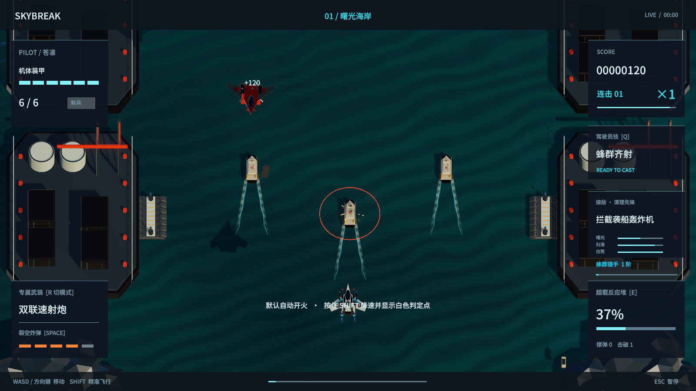
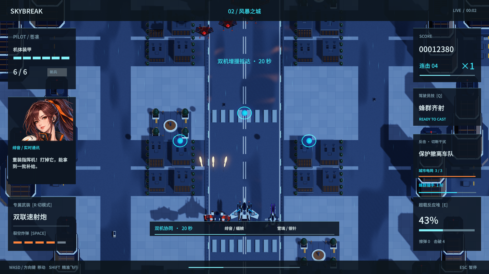
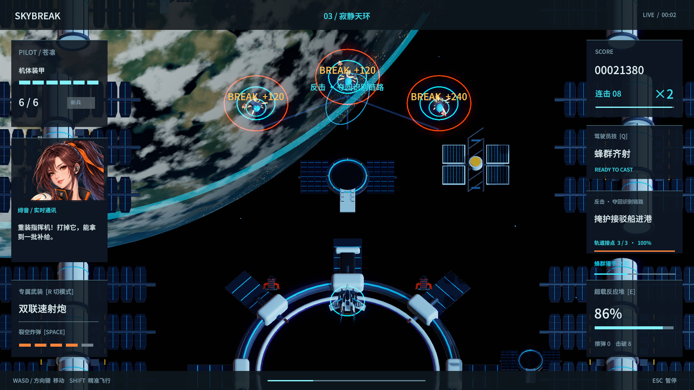

# 1.9 验证记录

Unity 6000.6.0f1，macOS 候选构建成功，0 错误、0 警告。检查与构建在本机独立进行，保留此前发行版；没有启动任何周期任务。

## 原生机制和通关

最终运行规则 **271 项通过，0 项失败**。新增验证包括 75 秒首领、跨过生成时间仍可生成、Boss 不重复生成、补给间奏、敌机撤离、刷怪预算、分段目标、城市/轨道封锁解除与跨关奖励只发一次。原有三语配音、手机输入、暂停恢复、武装、可拆解 Boss 和动画机制一起检查。

自动驾驶从新驾驶员、零研发、基础专精开始，使用实际武器和技能，不跳时间、改敌人生命或覆盖无敌。两倍模拟速度用于缩短等待，游戏内计时正常累积。随机种子为 50319 + 战机编号。

| 战机 | 首个 Boss 生成 | 三章总游戏时间 | 受击次数 | 结局装甲 |
|---|---:|---:|---:|---|
| 苍隼 | 75.02 秒 | 318.0 秒 | 2 | 6/6 |
| 蝠鲼 | 75.03 秒 | 372.9 秒 | 2 | 7/7 |
| 银针 | 75.01 秒 | 323.4 秒 | 2 | 6/6 |

三架飞机均完成三项民用目标并到达结局；记录中三台 Boss 都经历了三个生命阶段。自动驾驶验证流程与可达性，不代表真人难度已经完全平衡。后两台 Boss 按各自章节计时在约 95、110 秒生成。

## 击破性能

180 次连续击破，360 个采样帧：

- 平均帧时间 18.380 毫秒，P95 17.575 毫秒，P99 82.520 毫秒。
- 单次击破 CPU 最高 0.169 毫秒，粒子峰值 815，测试期间新建冲击波对象 0。
- 旧 1.8 记录分别为平均 21.698、P95 22.162、P99 192.334 毫秒，最高击破 CPU 1.941 毫秒。不同时间运行会受电脑负载影响，不能把这组对比视为所有设备的固定增幅。

本次没有观察到普通击破触发人为停帧。仍有偶发长帧；不以平均帧率宣称完全消除卡顿。背景静态内容按材质合并，移动的车辆保留独立对象；城市电力不变时不重复写入窗口材质，轨道 180 个星点共用一个网格。

## 画面与声音

实际查看海岸、城市、轨道、爆炸和 Boss 画面，新增 Blender 模型均成功导入，海面/地面/后期着色器在原生运行时受支持。没有只依据构建成功宣称视觉通过。

28 份音乐及音效 WAV 未发现满幅削波样本。三组基础/强化音乐声部采样数一致，所有音乐文件的首尾样本接缝差为 0；这些是文件检查，不等于任意音量、任意音效叠加都没有失真。运行检查确认换机不重启音乐、超载提高同步声部、音频设备重置后声部重新对齐；中英日各 110 个事件实际加载，试听、暂停和恢复通过。

## 网页与手机复核

Web 构建成功，0 错误、0 警告。独立 Chromium 浏览器完成换机音乐连续性、实际开火、炸弹和暂停检查；连续驾驶第一关，采样首次发现 Boss 的时间为 75.23 秒。七个战斗段落全部经过，补给与警戒段停止普通刷怪，音乐强度按阶段下降和恢复。

该次连续驾驶采集 9,235 个浏览器绘制间隔，平均 8.34 毫秒、P95 9.90、P99 10.20 毫秒；这是本机桌面浏览器结果，不代表手机帧率，也不等于 Unity 主线程耗时。155 次混音采样峰值为 0.905，未检出满幅削波，音乐与语音实际播放；第一次载入声音时有 Unity 异步解码期间的元数据提示，没有发现解码错误、浏览器错误或因此中断播放。

手机使用 Chromium 设备模拟，844 × 390、五点触摸，15 项检查通过：触摸选机与专精、英日语加载及试听、二维移动、双指炸弹、不残留移动输入、精确模式、技能、换武器、旋转暂停、恢复、保存和无页面溢出。实际查看触屏战斗画面。冷启动请求没有跨站资源，CSP、入口脚本和样式完整性检查通过。

未测试实体 iPhone/Android、移动网络或原生 Safari。上述记录验证了本轮输入、流程和资源完整性，不能替代这些设备的实测。

原生构建输入指纹：`3274fe6913cf07d0290cd017798e058f5aaf78a45c0a74d5c6a398ab7af90841`。

网页构建输入指纹：`0d13d3d89200c8ae2818523c9d357f08f3ce44280b423a35bd0da603d311c803`。本机详细记录位于 `Build/Verify1.9`、`Build/QA`；公网部署清单通过 `build-info.json` 关联源码版本和实际资源校验值。
