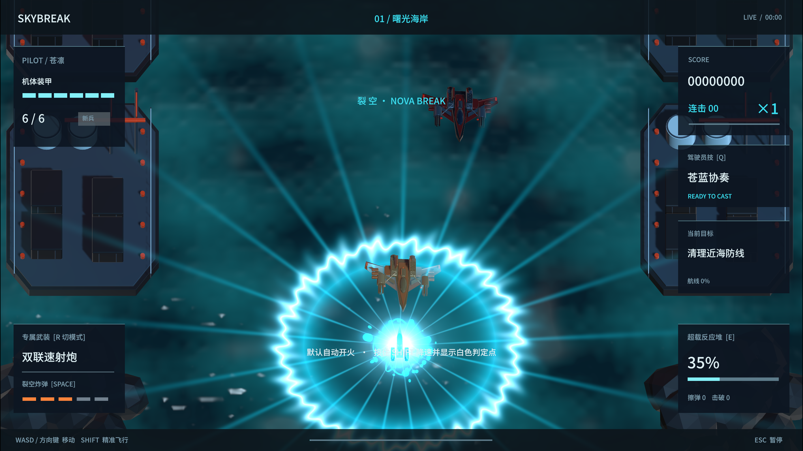
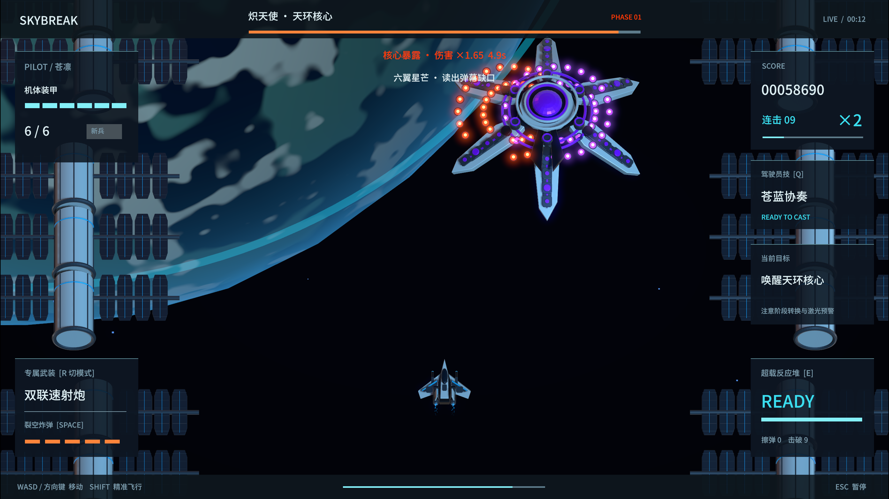

# SKYBREAK · 裂空：最后航线

原创日式科幻 3D 飞行射击游戏。三位成年驾驶员、三架特色战机、六种武装模式、机甲超载与三章机械首领战。

**当前网页版：1.9.1 · 修复手机横屏人物变形、清晰度与细节闪动。Mac 下载版：1.9.0。**

## 直接在线试玩

### [▶ 点击进入《裂空》驾驶舱](https://geduolin1991.github.io/skybreak-last-flight/)

手机与电脑使用同一个链接。手机自动进入触屏界面，点击「加载游戏」，载入后横屏进入驾驶舱；左手摇杆，右手技能，默认自动开火。电脑保留键盘操作。无需安装 Unity，进度保存在当前浏览器。

1.9.1 保持横屏人物原比例，稳定转屏时的画布尺寸，增加「均衡 / 清晰 / 流畅」三档画质，并修正缩小后的立绘与高光闪动。详见 [手机显示修复记录](Docs/手机显示修复1.9.1.md)。

网页与下载版包含三架战机、六种主武器、九条战术专精和三章机械首领战。1.6 将救援船、城市电网、轨道船坞做成可见的任务对象；金色补给召来另外两位驾驶员的限时僚机；1.7 优化连续击破与空地分层，加入六位角色的中英日三语配音，以及随战局变化的敌方指挥官立绘。

机库点击「战术专精」选择路线。「驾驶员档案」可试听；「系统设置 → 声音与配音」可调节语音。声音为原创合成声线。语言可在声音设置切换。详见 [1.7 更新说明](Docs/更新说明1.7.md)。手机菜单与完整玩法见 [1.8 手机版说明](Docs/更新说明1.8.md)。设备模拟已验证，实体手机性能因机型而异。

1.9 重新编排三章战斗：首个 Boss 在 75 秒生成，加入反击与补给间奏、跨章节救援回报、海面阴影、湿地反光与三套 Blender 环境细节。见 [1.9 更新说明](Docs/更新说明1.9.md)。

## 下载试玩

### [下载 Mac 试玩包](https://github.com/geduolin1991/skybreak-last-flight/releases/latest/download/SKYBREAK-macOS.zip)

[版本下载页](https://github.com/geduolin1991/skybreak-last-flight/releases/latest) · [Unity 源码压缩包](https://github.com/geduolin1991/skybreak-last-flight/releases/latest/download/SKYBREAK-Unity-Source.zip)

1. 下载并解压 `SKYBREAK-macOS.zip`。
2. 打开解压目录中的 `Build/SKYBREAK.app`，或双击 `开始游戏.command`。
3. 在机库选择战机，按 Enter 开始行动；阅读简报后再次按 Enter 出击。

试玩不需要安装 Unity 或 Blender。除网页版本外，另提供 **Mac 下载版**；Windows 用户可以使用上面的浏览器试玩。GitHub 的绿色 Code → Download ZIP 是源码，不是已编译的游戏。

本试玩包尚未经过 Apple 公证。如果首次打开提示“无法验证开发者”，请先确认来自本仓库；确认信任后，可按 [Apple 的说明](https://support.apple.com/en-ie/102445)，在系统设置 → 隐私与安全中选择“仍要打开”，仅为这个应用授权。下载页提供 SHA-256 校验值。

## 战斗与画面

- **裂空炸弹**：聚能、由近至远扩散的等离子波前、径向折射、连续爆破和分层音效。
- **可拆解的 Boss**：独立炮台和护盾节点，破盾后 8 秒核心易伤；三台 Boss 各有四套攻击和三阶段变化。
- **真正运动的机械结构**：暴风眼的双涡轮旋转，炽天使的六翼随蓄力与核心暴露开合。
- **不同的操作体验**：苍隼双联速射与追踪弹群，蝠鲼破片覆盖与重型爆破，银针两种贯穿轨道炮。
- **三章航线**：海岸撤离、风暴都市、轨道天环；支线救援、局内强化、驾驶员成长和无尽航线。
- **原创资产**：Blender 制作机体与环境，原创配乐和合成音效，三位驾驶员保留自然动态立绘。

## 操作

| 按键 | 功能 |
|---|---|
| WASD / 方向键 | 移动 |
| Shift | 减速、精准飞行与显示判定点 |
| Q | 驾驶员专属技能 |
| E | 能量满后展开机甲超载 |
| 空格 | 裂空炸弹 |
| R | 切换当前战机的两种武装模式 |
| Esc | 暂停 |
| Enter | 开始行动 / 确认简报 |
| F11 / 网页下方全屏按钮 | 全屏 / 窗口 |

默认自动射击。初次游玩建议新兵难度。完整玩法与设置见[试玩手册](README_开始试玩.md)。

## 使用 Unity 继续制作

本仓库根目录就是独立的 Unity 项目。用 **Unity 6000.6.0f1** 打开，加载 `Assets/Scenes/Skybreak.unity` 后运行。游戏在运行时建立关卡与界面。菜单 **Skybreak** 提供工程准备、macOS 构建和资源/规则检查。

- `Assets`：游戏逻辑、模型、材质、着色器、音频与驾驶员资源。
- `Packages` / `ProjectSettings`：固定依赖和 Unity 项目设置。
- `Tools`：可编辑 Blender 源文件和资产生成工具；本轮新增 `Environment1.9.blend`，机体与历史生产场景继续保留。
- `Docs`：游戏设计、美术、更新说明、验证记录和第三方许可。

网页构建说明见[网页版本说明](Docs/网页版本说明.md)。`main` 保存源码，`gh-pages` 单独保存编译后的网页成品。

本地构建缓存、试玩应用、旧版本备份及发行压缩包不进入源码分支的 Git 历史。已编译游戏和完整源码存档在本仓库 Releases 中提供。

## 验证与许可说明

本轮节奏、光影、音频和性能检查见 [1.9 验证记录](Docs/验证记录1.9.md)。手机适配的历史记录见 [1.8 验证记录](Docs/验证记录1.8.md)。三语配音的详细核验见 [1.7 验证记录](Docs/验证记录1.7.md)。历史版本的验证记录继续保留。自动通关与规则检查不等于所有难度、所有设备的长期真人平衡验收。

本仓库公开供查看与试玩；公开不代表所有内容采用同一种开源许可证。项目资产来源和第三方许可见[资产与许可](Docs/资产与许可.md)，嵌入包另保留其许可证。
